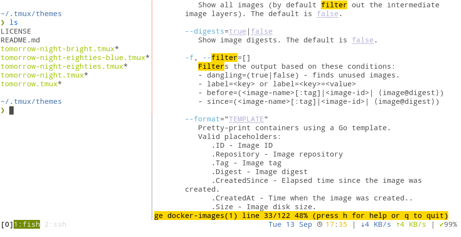

# tmux-tomorrow

> 5 flavors of Tomorrow theme based on specifications from [Tomorrow Theme](https://github.com/chriskempson/tomorrow-theme) (_i.e._ _dark_/_blue_ and _light_).

## Variations

All [5 variations](https://github.com/chriskempson/tomorrow-theme#take-a-look) have been implemented:

- Dark bright: `tomorrow-night-bright`
- Dark eighties blue: `tomorrow-night-eighties-blue`
- Dark eighties: `tomorrow-night-eighties`
- Dark: `tomorrow-night`
- Light: `tomorrow`

## Usage

Include the theme of your choice in `tmux.conf` like this:

    set -g default-terminal "screen-256color"  # Setting the correct term
    source-file ~/.tmux/themes/tomorrow.tmux

## Thanks

- based on initial work by [KuoE0's work](https://github.com/KuoE0/tmux-tomorrow-night) ;
- initial work by [chriskempson/tomorrow-theme](https://github.com/chriskempson/tomorrow-theme)
